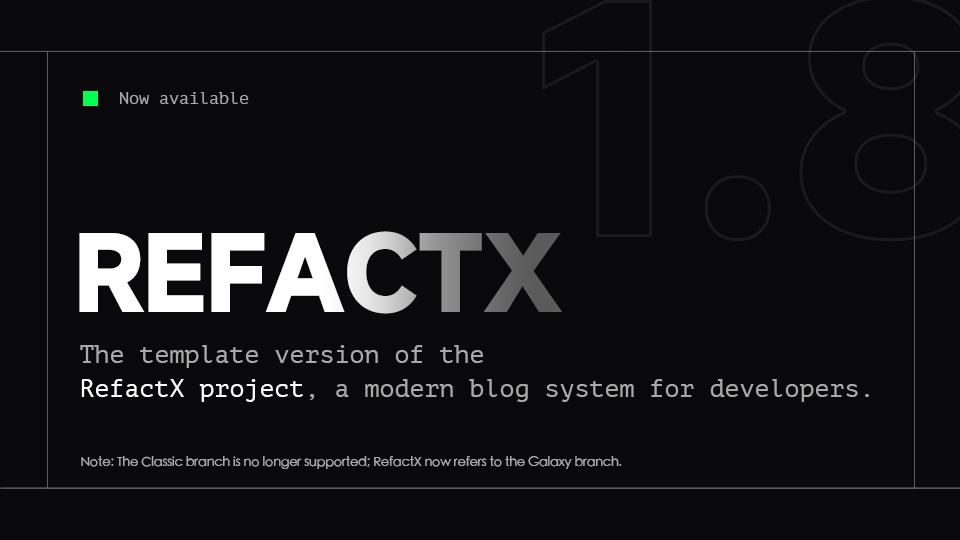

# RefactX 主题

在此处查看预览：<https://refact-x-template.vercel.app/>

> [!WARNING]
>
> 此项目可能有安全性漏洞，根据MIT许可证，由此造成的损失不由本模版负责，您在使用本博客的时候即视为接受该风险。你必须修改 `./src/config.ts` 中的相关内容，不得直接用于生产环境。完整配置教程请参考：<https://refact-x-template-git-galaxy-msrefs-projects.vercel.app/> 中的相关文章。

  
[English version](./README_EN.MD)

一款为内容创作者和开发者打造的现代、优雅的 Astro 主题。

> [!NOTE]
>
> 开发者对开源程序无必须的维护义务。若你希望实现某些功能，请先尝试自行解决；如有可能，欢迎提交 PR。

## 核心功能

### 内容管理系统（CMS）

- 哈希加盐密码校验后台，有尝试频率限制
- 可视化管理文章、项目展示、友链列表和图库资源
- 配合图床实现照片上传，并返回正确的URL，以markdown格式插入

### 自带定制化的Waline评论系统

- 可配合S3对象存储的图像上传

### 响应式设计

- 流畅布局，无缝适配各类设备
- 全屏幕尺寸下均提供优化的阅读体验

### 性能优化

- 资源优化，实现页面快速加载
- 内置图片优化能力（仅对于静态资源）
- 极简的 JavaScript 使用率

### 开发者体验

- 提供 VS Code 代码片段，助力快速创建内容（CMS能很好地替代该功能）
- 结构化的内容组织方式
- 类型安全的内容集合

### 内置功能

- 基于标签的导航体系
- 阅读时长预估功能
- SEO 优化配置
- 深色/浅色模式切换
- 社交媒体预览支持

### 内容专注体验

- 无干扰的沉浸式阅读环境
- 多种内容布局可选
- 代码语法高亮显示
- 响应式图片画廊

## 其他说明

本项目使用 **pnpm** 包管理器进行依赖管理。

本项目在且仅在 Vercel 通过测试，为了避免兼容性问题，请通过 Vercel 部署此项目，

原始版本源自 [Litos theme](https://github.com/Dnzzk2/Litos)（MIT 许可证）。

本副本由 Refac7 维护，沿用原始版本的 MIT 许可证。
