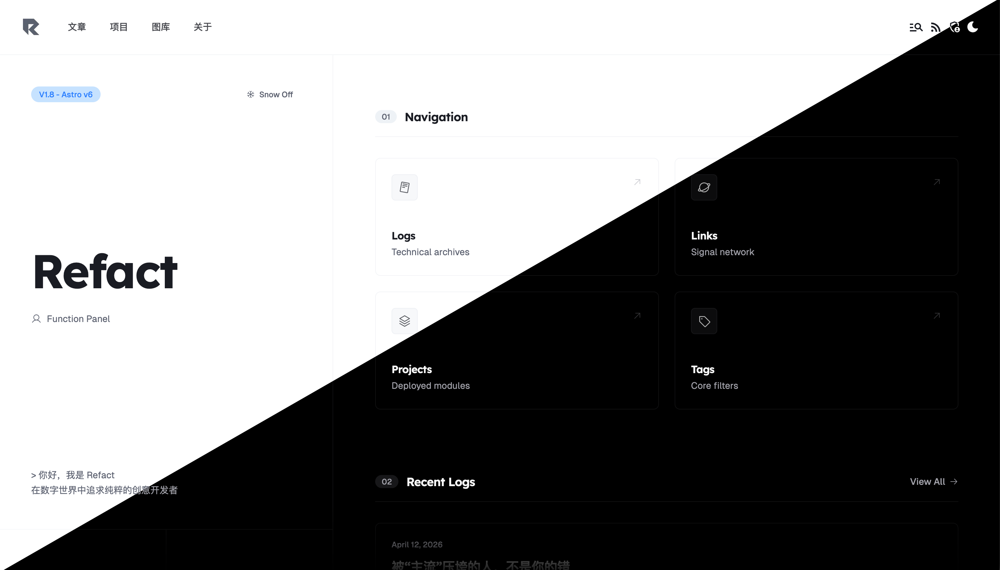

# RefactX Theme

Preview：<https://refact-x-template.vercel.app/>

> [!WARNING]
>
> This project may contain security vulnerabilities. In accordance with the MIT License, the template maintainers shall not be liable for any losses incurred as a result. By using this blog template, you acknowledge and accept such risks. You **must** modify the relevant configurations in `./src/config.ts` — **do not use this theme directly in production environments**. For the complete configuration guide, refer to the articles at: <https://refact-x-template-git-galaxy-msrefs-projects.vercel.app/>.

  
[中文版本](./README.MD)

A modern, elegant Astro theme designed specifically for content creators and developers.

> [!NOTE]
>
> Developers have no mandatory obligation to maintain open-source software. If you wish to implement specific features, please first attempt to resolve them independently. Pull Requests (PRs) are welcome if feasible.

## Core Features

### Content Management System (CMS)

- Backend with hash-salted password verification and login attempt frequency limiting
- Visual management of articles, project showcases, friend link lists, and gallery resources
- Integration with image hosting services to support photo uploads, returning valid URLs for direct insertion in Markdown format

### Built-in Customized Waline Comment System

- Image upload functionality compatible with S3 object storage

### Responsive Design

- Smooth layout that seamlessly adapts to all device types (desktop, tablet, mobile)
- Optimized reading experience across all screen sizes

### Performance Optimization

- Resource optimization for fast page loading
- Built-in image optimization capabilities (for static resources only)
- Minimal JavaScript footprint

### Developer Experience

- VS Code code snippets to accelerate content creation (this feature can be fully replaced by the CMS)
- Structured content organization
- Type-safe content collections

### Built-in Features

- Tag-based navigation system
- Reading time estimation
- SEO optimization configurations
- Dark/light mode toggle
- Social media preview support

### Content-Focused Experience

- Distraction-free immersive reading environment
- Multiple content layout options
- Syntax highlighting for code blocks
- Responsive image gallery

## Additional Notes

This project uses **pnpm** as the package manager for dependency management.

This project has been tested only on Vercel. To avoid compatibility issues, please deploy this project through Vercel.

Original version is derived from [Litos theme](https://github.com/Dnzzk2/Litos) (MIT License).  

This fork is maintained by Refac7 and inherits the MIT License from the original version.
